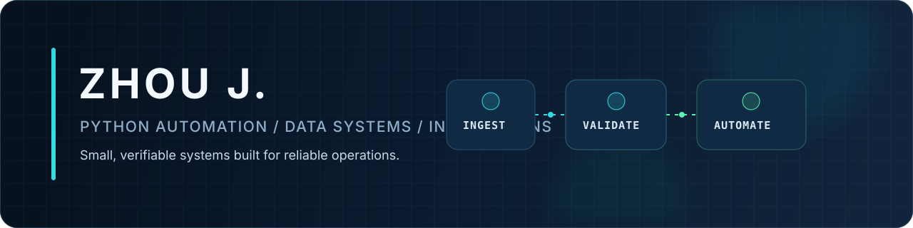
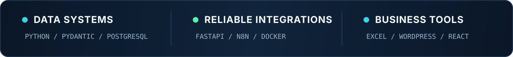
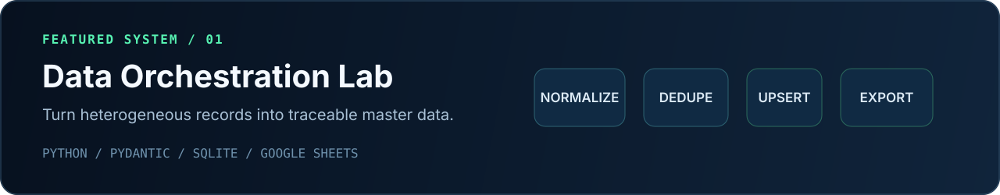
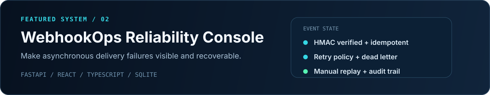
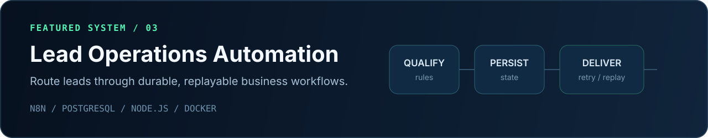

  <strong>English</strong> &nbsp;|&nbsp; <a href="./README.zh-CN.md">简体中文</a>

  

  

  <strong>I turn messy operational data and fragile manual processes into structured, testable workflows.</strong>

## Featured Systems

**Evidence:** schema-driven normalization, multi-key deduplication, record merging, SQLite upserts, CSV output, optional Google Sheets export, and automated tests.

**Evidence:** raw-byte HMAC verification, idempotency, retry policy, dead-letter handling, manual replay, audit records, and backend/frontend tests.

**Evidence:** durable task state, leases, fencing, retryable and terminal failure paths, manual replay, Docker Compose, and Playwright acceptance evidence.

<!-- OPEN_SOURCE_CONTRIBUTIONS_SLOT
Add this section after verified upstream contribution evidence exists.
Required fields per entry: upstream repository, pull request URL, contribution summary, role, and verified status.
Preferred evidence strength: merged PR, maintainer adoption, or complete reviewable PR.
-->

## More Builds

| Project | Verified focus |
|---|---|
| [Excel Automation Dashboard](https://github.com/szzhoujiarui/xlsm-demo) | VBA and Python workbook automation, PivotTables, PivotCharts, dashboards, and COM workflows |
| [Gutenberg Business Website](https://github.com/szzhoujiarui/figma-to-wordpress-business-showcase) | Custom bilingual block theme, reusable sections, forms, Docker Compose, and WP-CLI setup |
| [Drawing Vectorization Pipeline](https://github.com/szzhoujiarui/opencv-technical-drawing-vectorizer) | OpenCV preprocessing, geometry detection, normalization, and JSON, SVG, and DXF export |
| [Deskflow Studio](https://github.com/szzhoujiarui/deskflow-studio) | Interactive 3D product configuration, server-side pricing, and quotation snapshots |
| [WordPress Quote Manager](https://github.com/szzhoujiarui/wp-service-quote-manager) | Quote workflow states, CSV export, scheduled retries, and HMAC webhooks |

## How I Engineer

1. Start with explicit inputs, outputs, constraints, and acceptance criteria.
2. Keep integrations behind replaceable adapters and make failure states observable.
3. Ship setup notes, verification commands, assumptions, and honest implementation boundaries.

  Projects are personal demos or technical prototypes unless a repository states otherwise. Each repository documents scope, verification status, and integration boundaries.

